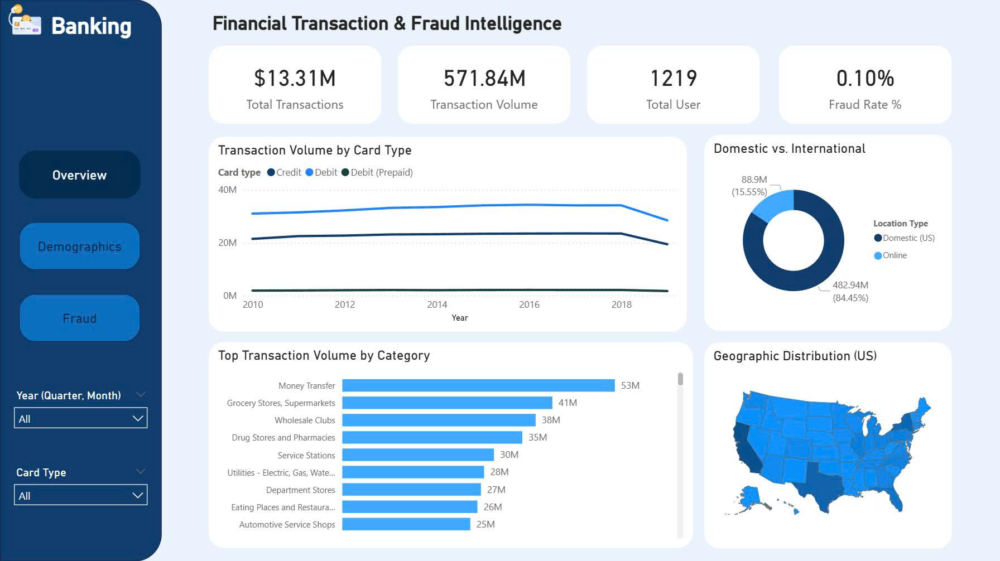
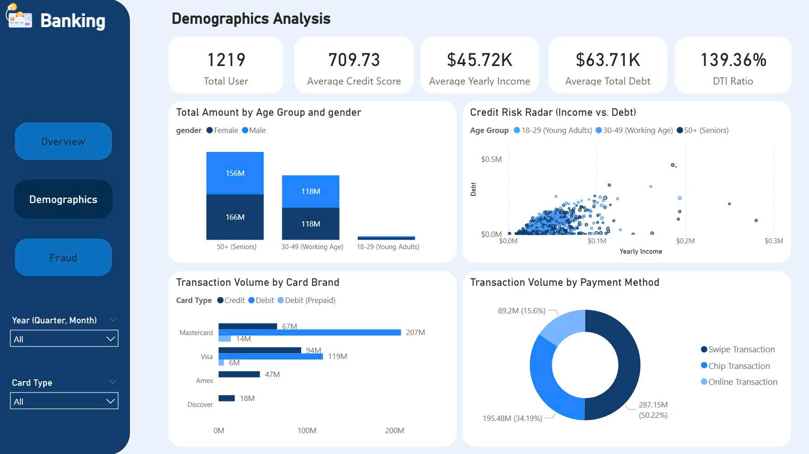
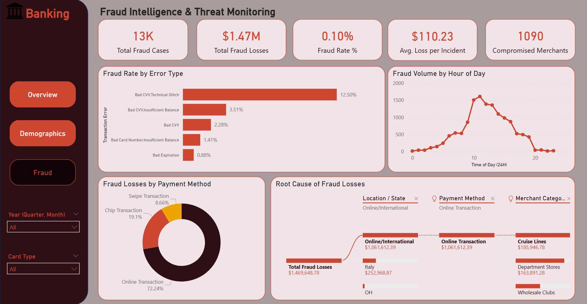

# 🛡️ Banking Big Data: Financial Transaction & Fraud Intelligence

## 📌 1. Project Overview & Objectives

**Domain:** Banking & Finance / Risk Management  
**Objective:** To conduct a comprehensive analysis of customer spending behaviors and deeply dissect the anomalies that distinguish legitimate transactions from fraudulent ones. The ultimate goal is to provide the Risk Control team with data-driven insights to establish automated, real-time alert rules based on actual behavioral patterns.

**Data Landscape:** The project utilizes an extensive system of credit and debit card transaction data spanning the 2010s, combined with customer demographics, card profiles (credit limits, security features), and Merchant Category Codes (MCC). 
* **Scale:** Over 13 million transactions, 1,219 unique users.
* **Challenge:** Extreme class imbalance, with actual fraud accounting for only ~0.15% of all labeled transactions.

**Expected Output:** An end-to-end analytical pipeline featuring interactive Power BI dashboards that provide a top-down view (from macro-economic trends to micro-fraud characteristics) and a highly optimized Machine Learning model to detect high-ticket fraud. This project demonstrates a complete data workflow from data extraction to business intelligence and predictive modeling.

---

## 🛠️ 2. Tech Stack & Tools

* **Data Extraction & Transformation:** Google BigQuery (SQL).
* **Data Visualization & Storytelling:** Power BI (DAX, Interactive Dashboards, UI/UX optimization).
* **Exploratory Data Analysis (EDA) & Feature Engineering:** Python (Pandas, NumPy, Seaborn, Matplotlib).
* **Machine Learning:** Scikit-Learn, XGBoost, Optuna (Hyperparameter Tuning), SHAP (Model Interpretability).

---

## 📊 3. Business Intelligence Dashboards & Deep Analytics

### Layer 1: The Big Picture (Overview)

**Key Performance Indicators (KPIs):**
The system is actively processing a robust **$571.84M** in total transaction volume across **13M+** successful transactions. The overall fraud rate is strictly controlled at **0.10%**, which is highly secure by industry standards.

**Strategic Insights:**
* **Credit vs. Debit:** Credit cards dominate the profitable cash flow. Prepaid debit cards cater only to a niche market.
* **Domestic vs. International:** A massive **84.45% ($482.94M)** of transaction volume is strictly domestic (US-based). Online/International transactions account for 15.55%, indicating an untapped e-commerce market but also a highly concentrated physical POS network that needs maintenance.
* **Top Spending Categories:** Customers heavily utilize their cards for **Money Transfers ($53M)** and **Grocery Stores ($41M)**. This represents a golden opportunity for the Marketing team to design targeted Cashback campaigns for essential spending.

### Layer 2: Customer Profiling & Risk Radar

**The Hidden Debt Crisis:**
While the average customer maintains a "Good" FICO Credit Score of **709.73**, their financial reality is alarming. The average yearly income is **$45.72K**, yet the average total debt is **$63.71K**. This results in a massive **Debt-to-Income (DTI) Ratio of 139.36%**—a major red flag indicating that the customer base is highly leveraged and vulnerable to default risk.

**Behavioral Risk Insights:**
* **The "Senior" Goldmine:** The **50+ age demographic** accounts for the absolute majority of spending (over $322M). Cybercriminals know that seniors possess high credit limits but often lack advanced tech-savviness, making them prime targets for phishing and card skimming.
* **The "Swipe" Vulnerability:** Shockingly, **50.22%** of transaction volume still occurs via legacy **Swipe (Magnetic Stripe)** technology. This outdated security method is the root cause of card data leaks (skimming), feeding the dark web with raw 16-digit card numbers.

### Layer 3: Fraud Investigation & Modus Operandi

**The Attack Scale:**
The system recorded approximately **13,000 fraud cases** resulting in a **$1.47M loss**. The average loss per incident is **$110.23**, showing that hackers aim for maximum extraction per successful breach. Furthermore, these attacks are spread across **1,090 merchants**—a deliberate "Smurfing" tactic to stay under the bank's AI radar by not overwhelming a single merchant's payment gateway.

**Modus Operandi (How they do it):**
* **The "Bad CVV" Brute-force:** The highest error rate associated with fraud is "Bad CVV / Technical Glitch" (12.50%). Because criminals stole card numbers via physical *Swipe* terminals, they don't have the 3-digit CVV. They use automated Bots to brute-force the CVV on e-commerce sites, crashing payment gateways in the process.
* **Camouflage Timing:** Contrary to the belief that hackers strike at 3 AM, fraud volume peaks between **10 AM and 1 PM**. Hackers intentionally inject fraudulent transactions during the lunch-break online shopping rush to blend in with millions of legitimate requests.
* **Money Laundering Channels:** **72.24%** of stolen funds are funneled into **Online/International** transactions. Specific high-risk targets include **Cruise Lines** ($185K - draining credit limits instantly) and **Department/Wholesale Stores** (buying untraceable Gift Cards for resale on the Dark Web).

---

## 🗄️ 4. Data Architecture & Dictionary

The data schema relies on one central Fact table and several Dimension tables.

* **`transactions_data.csv` (Fact Table):** Contains `id`, `date`, `amount`, `mcc`, `merchant_id`, `errors`, `use_chip`.
* **`cards_data.csv` (Dim Table):** Contains `card_type`, `credit_limit`, `has_chip`, `year_pin_last_changed`, `card_on_dark_web`.
* **`users_data.csv` (Dim Table):** Contains demographics, `yearly_income`, `total_debt`, `credit_score`.
* **`mcc_codes.json` (Dim Table):** Maps industry codes to names (e.g., 4829 = Money Transfer).

---

## 🔬 5. Technical EDA & Feature Engineering

Before modeling, mathematical EDA drove critical technical decisions:

1.  **High Cardinality Eradication:** Variables like `zip` (9,316 unique values) and `merchant_city` (4,971 unique values) were dropped to prevent severe fragmentation and overfitting in tree-based models.
2.  **Target Leakage Prevention:** The `errors` column contains post-transaction responses (like "Bad CVV"). Using this would give the model the "answer key" from the future. It was removed strictly for ML training.
3.  **Outlier Preservation (`amount`):** The transaction amount is heavily right-skewed. While standard practices recommend dropping outliers, we **kept them**. In fraud detection, high-ticket outliers ($4000+) are the exact anomaly signals the model needs to catch.
4.  **Feature Engineering:**
    * `trans_count_24h` (Velocity): Number of transactions in the last 24 hours. (Top SHAP feature).
    * `amount_vs_30d_avg`: The transaction amount compared to the user's historical 30-day average.
    * `dti_ratio`: Debt-to-Income ratio (Total Debt / Yearly Income).
    * `amount_vs_monthly_income`: Captures the financial strain of a single transaction.

---

## 🤖 6. Machine Learning Implementation

**Algorithm Selection:** Given the extreme right-skewness of `amount`, crucial outliers, and non-linear relationships, **XGBoost** was chosen over linear algorithms.

**Handling Class Imbalance (0.15% Fraud):**
We bypassed SMOTE and utilized XGBoost's native **`scale_pos_weight`** parameter. This fundamentally penalized the algorithm heavily for missing a fraud case, increasing our validation score to **0.7498**.

**Business-Centric Threshold Tuning:**
Instead of using the default 0.5 probability threshold, we plotted a Cost-Benefit 'U-Curve'. 
* **False Positive Penalty:** $10 (Customer service cost).
* **False Negative Penalty:** 100% of the transaction amount (Bank absorbs the loss).
* **Result:** The optimal "Sweet Spot" threshold was identified at **0.43**, minimizing total monetary loss to the business.

---

