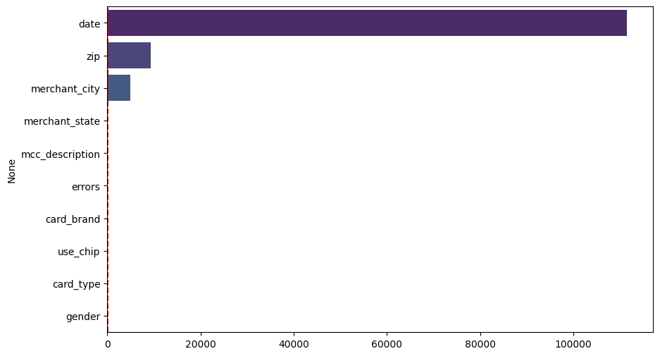
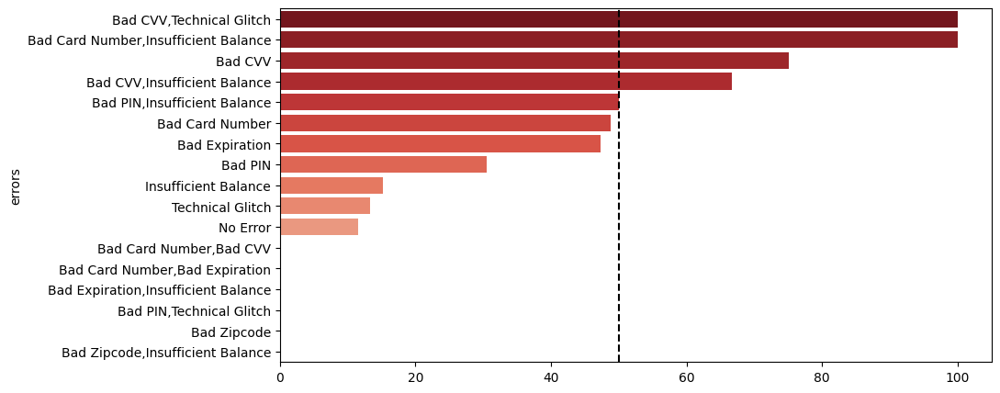
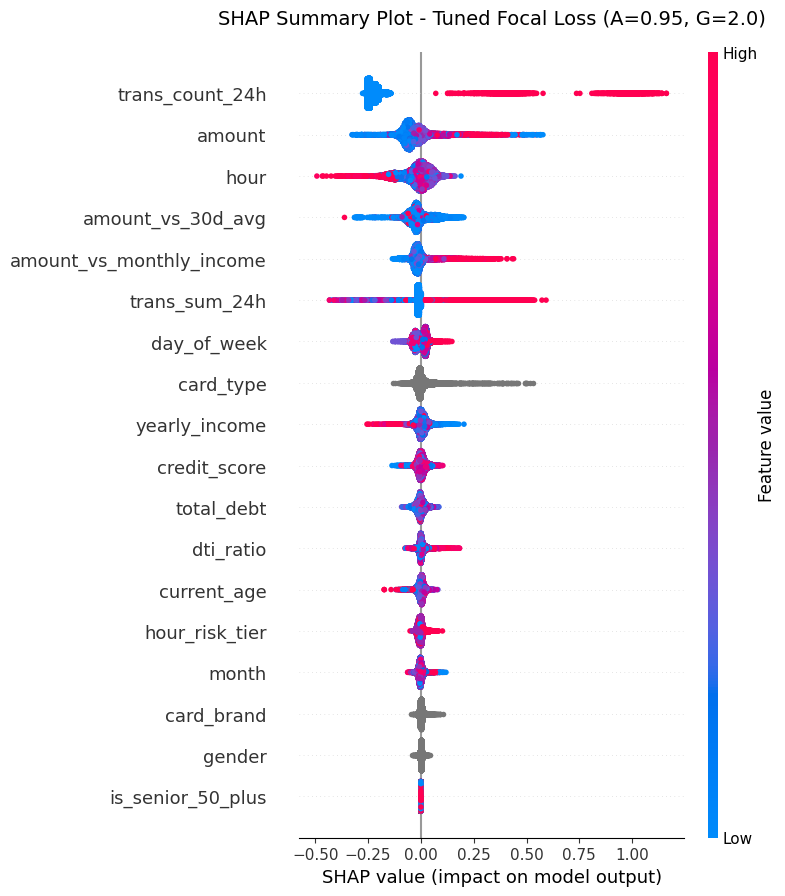
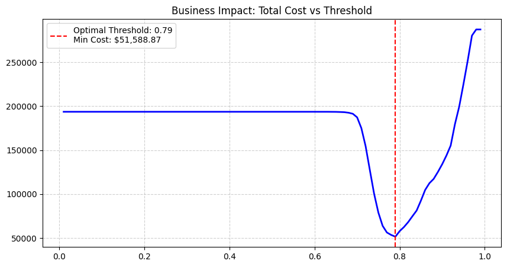

# 🛡️ Banking Big Data: Financial Transaction & Fraud Intelligence

## 📌 1. Project Overview & Objectives

**Domain:** Banking & Finance / Risk Management  
**Objective:** To conduct a comprehensive analysis of customer spending behaviors and deeply dissect the anomalies that distinguish legitimate transactions from fraudulent ones. The ultimate goal is to provide the Risk Control team with data-driven insights to establish automated, real-time alert rules based on actual behavioral patterns.

**Data Landscape:** The project utilizes an extensive system of credit and debit card transaction data spanning the 2010s, combined with customer demographics, card profiles (credit limits, security features), and Merchant Category Codes (MCC). 
* **Scale:** Over 13 million transactions, 1,219 unique users.
* **Challenge:** Extreme class imbalance, with actual fraud accounting for only ~0.10% of all labeled transactions.

**Expected Output:** An end-to-end analytical pipeline featuring interactive Power BI dashboards that provide a top-down view (from macro-economic trends to micro-fraud characteristics) and a highly optimized Machine Learning model to detect high-ticket fraud. This project demonstrates a complete data workflow from data extraction to business intelligence and predictive modeling.

👉 **[Click here to view Interactive Power BI Dashboard](https://app.powerbi.com/view?r=eyJrIjoiZjI4MTc3NGEtNDY1Ni00OTkxLWE3NzQtNDVhNmYxYmNlZWIzIiwidCI6IjVlOGIzMjY5LTc2Y2EtNDU3Yy04NDdmLTQ0NGUzZGI5ODZhNyIsImMiOjl9)**

---

## 🛠️ 2. Tech Stack & Tools

* **Data Extraction & Transformation:** Google BigQuery (SQL).
* **Data Visualization & Storytelling:** Power BI (DAX, Interactive Dashboards, UI/UX optimization).
* **Exploratory Data Analysis (EDA) & Feature Engineering:** Python (Pandas, NumPy, Seaborn, Matplotlib).
* **Machine Learning:** Scikit-Learn, XGBoost, Optuna (Hyperparameter Tuning), SHAP (Model Interpretability).

---

## 📊 3. Business Intelligence Dashboards & Deep Analytics

### Layer 1: The Big Picture (Overview)

**Key Performance Indicators (KPIs):**
The system is actively processing a robust **$571.84M** in total transaction volume across **13M+** successful transactions. The overall fraud rate is strictly controlled at **0.10%**, which is highly secure by industry standards.

**Strategic Insights:**
* **Credit vs. Debit:** Credit cards dominate the profitable cash flow. Prepaid debit cards cater only to a niche market.
* **Domestic vs. International:** A massive **84.45% ($482.94M)** of transaction volume is strictly domestic (US-based). Online/International transactions account for 15.55%, indicating an untapped e-commerce market but also a highly concentrated physical POS network that generates the primary revenue stream.
* **Top Spending Categories:** Customers heavily utilize their cards for **Money Transfers ($53M)** and **Grocery Stores ($41M)**. This represents a golden opportunity for the Marketing team to design targeted Cashback campaigns for essential spending.

### Layer 2: Customer Profiling & Risk Radar

**The Hidden Debt Crisis:**
While the average customer maintains a "Good" FICO Credit Score of **709.73**, their financial reality is alarming. The average yearly income is **$45.72K**, yet the average total debt is **$63.71K**. This results in a massive **Debt-to-Income (DTI) Ratio of 139.36%**—a major red flag indicating that the customer base is highly leveraged and vulnerable to default risk. If an economic downturn occurs, a cascade of defaults is inevitable.

**Behavioral Risk Insights:**
* **The "Senior" Goldmine:** The **50+ age demographic** accounts for the absolute majority of spending (over $322M). Cybercriminals know that seniors possess high credit limits but often lack advanced tech-savviness, making them prime targets for phishing and card skimming.
* **The "Swipe" Vulnerability:** Shockingly, **50.22%** of transaction volume still occurs via legacy **Swipe (Magnetic Stripe)** technology. This outdated security method does not encrypt static data, making it the number one target for skimming devices installed at gas stations or supermarkets, directly feeding the dark web with raw 16-digit card numbers.

### Layer 3: Fraud Investigation & Modus Operandi

**The Attack Scale:**
The system recorded over **13,000 fraud cases** resulting in a **$1.47M loss**. The average loss per incident is **$110.23**, showing that hackers aim for maximum extraction per successful breach. Furthermore, these attacks are spread across **1,090 merchants**—a deliberate "Smurfing" tactic to stay under the bank's Spike Detection algorithms by not overwhelming a single merchant's payment gateway.

**Modus Operandi (How they do it):**
* **The "Bad CVV" Brute-force & Card-Not-Present (CNP):** An astonishing **72.24%** of fraud losses occur in Online environments. The highest error rate associated with fraud is "Bad CVV" (12.50%). Because criminals stole card numbers via physical *Swipe* terminals, they don't have the physical cards or the 3-digit CVV. They program Botnets to brute-force the CVV on e-commerce sites, generating continuous "Bad CVV" errors until they guess correctly.
* **Camouflage Timing:** Contrary to the belief that hackers strike at night, fraud volume peaks between **10 AM and 1 PM**. Hackers intentionally inject fraudulent transactions during the lunch-break online shopping rush to blend in with millions of legitimate requests, lowering the sensitivity of Anomaly Detection Systems.
* **Money Laundering Channels:** Once successful, hackers launder the stolen funds by purchasing high-ticket items like **Cruise Lines** ($185K) or buying untraceable Gift Cards from **Department Stores** ($163K).

---

## 🗄️ 4. Data Architecture & Dictionary

The data schema relies on one central Fact table and several Dimension tables.

* **`transactions_data.csv` (Fact Table):** Contains `id`, `date`, `amount`, `mcc`, `merchant_id`, `errors`.
* **`cards_dat.csv` (Dim Table):** Contains `card_type`, `credit_limit`, `has_chip`, `year_pin_last_changed`, `card_on_dark_web`.
* **`users_data.csv` (Dim Table):** Contains demographics, `yearly_income`, `total_debt`, `credit_score`.
* **`mcc_codes.json` (Dim Table):** Maps industry codes to names (e.g., 4829 = Money Transfer).
* **`train_fraud_label.json`:** Binary label( 0 = No, 1 = Fraud).
---

## 🔬 5. Technical EDA & Feature Engineering

Before modeling, rigorous Exploratory Data Analysis (EDA) drove critical technical decisions:

1.  **High Cardinality Eradication:** Variables like `zip` (9,316 unique values) and `merchant_city` (4,971 unique values) were dropped to prevent severe fragmentation and overfitting in tree-based models.
    
2.  **Target Leakage Prevention:** The `errors` column contains post-transaction responses (like "Bad CVV"). Using this would give the model the "answer key" from the future. It was removed strictly for ML training.
    
3.  **Outlier Preservation (`amount`):** The transaction amount is heavily right-skewed. While standard practices recommend dropping outliers via IQR/Z-score, we **kept them**. In fraud detection, high-ticket outliers are the exact anomaly signals the model needs to catch.
4.  **Feature Engineering:**
    * `trans_count_24h` (Velocity): Number of transactions in the last 24 hours.
    * `amount_vs_30d_avg`: The transaction amount compared to the user's historical 30-day average.
    * `amount_vs_monthly_income`: Captures the financial strain of a single transaction.

---

## 🤖 6. Machine Learning Implementation

**Algorithm Selection:** Given the extreme right-skewness of `amount` and non-linear relationships, **XGBoost** (Tree-based) was chosen over linear algorithms as it is immune to skewed data and does not require scaling.

**Handling Class Imbalance (0.10% Fraud):**
To tackle the severe imbalance (~8:1 ratio in the training set after splitting), the system integrated **Focal Loss** directly into the XGBoost architecture. Unlike basic weighting, Focal Loss automatically adjusts weights during training, aggressively penalizing the model for misclassifying "hard examples" (complex fraud patterns). This breakthrough pushed the **PR-AUC** score significantly higher.

**Model Explainability (SHAP):**

The SHAP summary plot confirms the AI operates logically, heavily relying on engineered features rather than raw data:
* **Velocity Dominance:** `trans_count_24h` is the absolute top predictor. Continuous card swiping within 24 hours skyrockets the fraud probability.
* **Contextual Anomalies:** Features like `amount_vs_monthly_income` prove the AI cross-references the transaction against the user's financial context (e.g., a $1,000 transaction is normal for a VIP, but a red flag for a low-income user).

**Cost-Sensitive Learning & Threshold Optimization:**

The ultimate goal is business profitability, not just raw accuracy. A Cost-Benefit 'U-Curve' was plotted to balance:
* **False Positive (FP) Cost:** Lockout inconvenience (estimated at $10/user).
* **False Negative (FN) Cost:** 100% of the stolen amount.
* **Result:** The `min(costs)` function identified the optimal decision Threshold at **0.79**. At this strict threshold, the AI requires 79% certainty before blocking a card, minimizing customer complaints while keeping the total operational loss to the absolute minimum.

---

## 🚀 7. Strategic Recommendations

Based on the data-driven insights and AI findings, the following actions are recommended:

1.  **Phase Out Swipe Technology:** Gradually stop supporting magnetic stripe payments. Mandate EMV Chip or Contactless (NFC) cards, especially for the 50+ demographic, to cut off the data supply chain for skimming devices.
2.  **Velocity-Based Rule Engine:** Configure the IT Gateway to permanently block IPs or temporarily freeze accounts if "Bad CVV" is entered more than 3 times in 5 minutes. Trigger Step-up Authentication (FaceID/Smart OTP) if `trans_count_24h` spikes abnormally.
3.  **Dynamic Credit Limits:** Place customers with DTI > 100% on a Watchlist and halt Auto-Credit Line Increases. Shift the Core Banking system towards *Dynamic Limits* that cross-reference transaction values with the user's income in real-time.
4.  **Two-Tier ML Deployment:** Deploy the XGBoost (Focal Loss) model with the 0.79 threshold:
    * **Hard Decline (Score $\ge$ 0.79):** Instant transaction rejection and card freeze.
    * **Soft Verification (0.50 $\le$ Score < 0.79):** Suspend the transaction and send a Push Notification for the user to manually verify via the banking app, reducing False Positive frustration.
